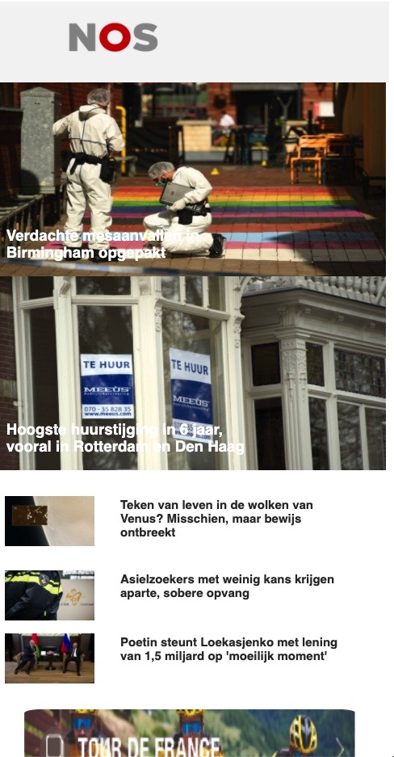
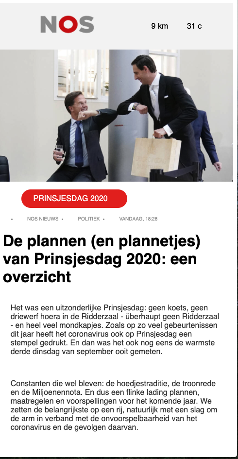
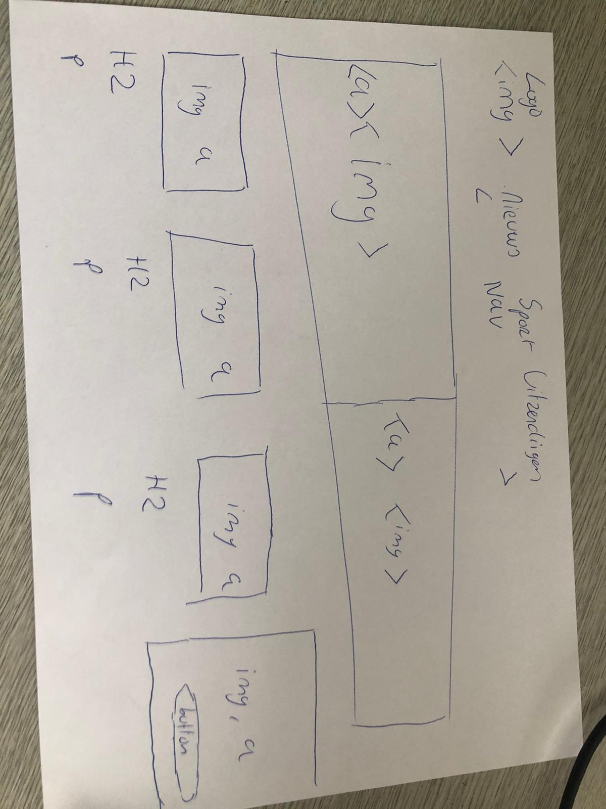

# Procesverslag
**Auteur:** -Emile Kost-

Markdown cheat cheet: [Hulp bij het schrijven van Markdown](https://github.com/adam-p/markdown-here/wiki/Markdown-Cheatsheet). Nb. de standaardstructuur en de spartaanse opmaak zijn helemaal prima. Het gaat om de inhoud van je procesverslag. Besteedt de tijd voor pracht en praal aan je website.

## Bronnenlijst
1. -bron 1-
2. -bron 2-
3. -...-

## Eindgesprek (week 7/8)

-dit ging goed & dit was lastig-

**Screenshot(s):**

-screenshot(s) van je eindresultaat-

## Voortgang 3 (week 6)

-same as voortgang 1-

## Voortgang 2 (week 5)

-same as voortgang 1-

## Voortgang 1 (week 3)

### Stand van zaken
Het coderen is mij niet zo soepel verlopen. Ik heb op een gegeven moment besloten om opnieuw te beginnen en te zorgen dat de site vanaf het eerste
moment al responsive gaat zijn. Toch heb ik hier nog wel moeite mee en ben
ik daar nu druk mee bezig. Ik ben nog niet zover maar ben van plan te zorgen
dat ik dit weekend sowieso de telefoon variant geheel af heb.
Javascript heb ik tot nu nog niet gebruikt. Wel probeerde ik een nightshift
toe te  voegen door middel van Javascript. Dit is nog niet gelukt.
Wat ik nog met  javascript wil proberen toe te voegen is een live temperatuur
die de NOS ook rechtsboven in het scherm laat zien.

**Screenshot(s):**

### Agenda voor meeting
1. Wat kan ik op mijn site met Javascript gaan doen?
2. Hoe krijg ik NOS's manier van responsive voor elkaar met coderen? (dingen komen en dingen verdwijnen met het schalen)
3. Hoe laat ik de "tour de france" foto inzoomen op zichzelf bij en hoover maar ervoor zorgen dat niet de height en width veranderen?
4. Is het mogelijk om met Javascript een live tempratuur te displayen in
de header?

### Verslag van meeting

-na afloop snel uitkomsten vastleggen-

## Intake (week 1)

Het startniveau ligt bij mij niet superhoog. Html en CSS beheers ik echter na wat opfrissing aardig goed. Javascript is het gene waar ik nog zeker wel moeite mee heb. Ik durf dan ook wel te zeggen dat ik een rode piste niveau ben. Zeker omdat ik coderen stiekem wel heel leuk en interessant vind.

Ik wil mij voornamelijk focussen op de surfaceplane van de website. Dit omdat ik goed visueel wil leren vormgeven doormiddel van Html, CSS en Javascript.
De website die ik wil gaan namaken is die van de NOS. Dit omdat ik graag het nieuws lees en ik het een website vind met interessante elementen, stijl en textuur.

## 2de website idee
Misschien is de NOS site iets te makkelijk. Ik zat daarom ook te kijken naar
de site van Spacex. Deze heeft een interessante stijl met aardig veel CSS en Javascript  . Dit zijn dan ook de punten die ik bij mezelf wil verbeteren op het vlak van coderen.

breakdown schets:

**Screenshot(s):**

**Breakdown-schets(en):**

